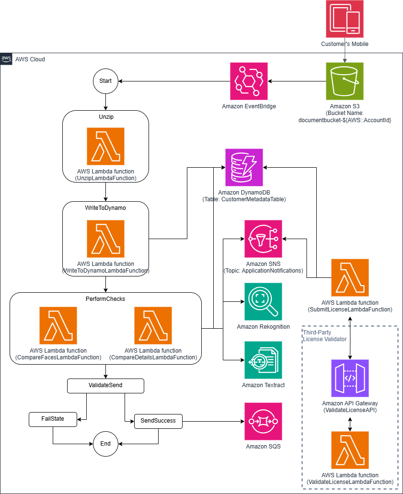
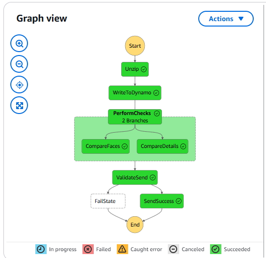
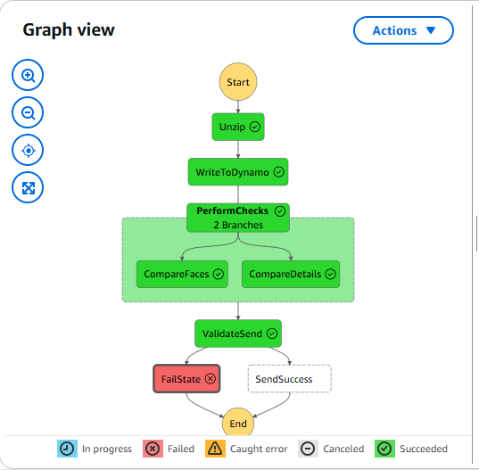

# Capstone Project: Building a Customer Onboarding Serverless Application on AWS

# Part 2: Asynchronous Operations

# 

# Overview

In this Part 2 of the capstone project, the **DocumentLambdaFunction**,
which was developed in Part 1, will be decomposed into four Lambda
functions. A state machine workflow will be developed to orchestrate the
flow of operations among these four functions. AWS Step Functions will
be utilized in developing the state machine. This development approach
modifies the serverless application in such a way that some operations
are executed asynchronously.

# Reference

Please refer to **readme_part1.md** for a detailed explanation of **Part
1 Synchronous Operations** and the Capstone Project. It can be found
under the **SynchronousOperations** folder.

# Operations

The **DocumentLambdaFunction** is decomposed into and replaced with the
following AWS Lambda functions:

1.  **UnzipLambdaFunction**: It performs the following tasks:

<!-- -->

-   Downloads the .zip file from S3 Bucket’s **zipped/** prefix into
    Lambda’s internal memory.

-   Unzips the file and uploads its individual files to S3 Bucket’s
    **unzipped/** prefix.

-   Extracts the **app-uuid** value from the .zip file.

> The function expects the following Lambda event:

```json
{
	"detail": {
   		"bucket":  {
       	    "name": "documentbucket-<AccountID>"
   	    },
	    "object":  {
       	    "key":  "zipped/<app-uuid>.zip"
   		}
	}
}
```

> The function is expected to return the following response:

```json
{
    "app_uuid": "<extracted_value>"
}
```

2.  **WriteToDynamoLambdaFunction**: It performs the following tasks:

<!-- -->

-   Downloads the .csv file from S3 Bucket's **unzipped/** prefix into
    Lambda's internal memory.

-   Parses the .csv file into a dictionary.

-   Writes the contents of the dictionary to DynamoDB table
    **CustomerMetadataTable** using the **app-uuid** as the partition
    key.

> The function expects the following Lambda event:

```json
{
    "detail": {
        "bucket":  {
            "name": "documentbucket-<AccountID>"
        },
    },
    "application":  {
        "app_uuid":  "<app-uuid>"
    }
}
```

> The function is expected to return the following response:

```
{
    "driver_license_id": <dirverlicensenumber>,
    "validation_override": <true_or_false>,
    "app_uuid": "<app-uuid>"
}
```

> This response will be sent later to Amazon SQS queue in such a way
> that the **SubmitLicenseLambdaFunction** can process it.

3.  **CompareFacesLambdaFunction**: It performs the following tasks:

<!-- -->

-   Calls Amazon Rekognition to compare the selfie image in
    **\<app_uuid\>\_selfie.png** with any detected image in the driver's
    license **\<app_uuid\>\_license.png** file.

-   If the comparison fails (i.e. a match is not found), then the it
    calls Amazon SNS to publish a message (using an email for example)
    to inform the bank.

-   Updates the Amazon DynamoDB table (using the partition key
    **\<app_uuid\>**) with the comparison result in the attribute
    **LICENSE_SELFIE_MATCH**.

> The function expects the following Lambda event:

```json
{
    "detail": {
        "bucket":  {
            "name": "documentbucket-<AccountID>"
        },
    },
    "application":  {
            "app_uuid":  "<app-uuid>"
    }
}
```

> The function is expected to return the following response:

```json
{
    "status": "<success_or_failure>",
    "message": "Selfie Comparison <successful_or_failed>"
}
```

4.  **CompareDetailsLambdaFunction**: It performs the following tasks:

<!-- -->

-   Calls Amazon Textract to extract pieces of text information from the
    customer’s driver’s license image **\<app_uuid\>.\_license.png**
    file.

-   Compares the extracted text with the contents of the .csv file
    **\<app_uuid\>\_details.csv**.

-   If the comparison fails (i.e. the personal details that the customer
    provided do not match the details in the driver’s license), then the
    it calls Amazon SNS to publish a message (using an email for
    example) to inform the bank.

-   Updates the Amazon DynamoDB table (using the partition key
    **\<app_uuid\>**) with the comparison result in the attribute
    **LICENSE_DETAILS_MATCH**.

> The function expects the following Lambda event:

```json
{
    "detail": {
        "bucket":  {
            "name": "documentbucket-<AccountID>"
        },
    },
    "application":  {
            "app_uuid":  "<app-uuid>"
    }
}
```

> The function is expected to return the following response:

```json
{
    "status": "<success_or_failure>",
    "message": "ID Information Comparison <successful_or_failed>"
}
```


Figure 1 illustrates the architecture of asynchronous operations using a
state machine workflow. When a .zip file containing the customer's
selfie, driver's license, and details is uploaded to the S3 Bucket's
**zipped/** prefix, an Amazon EventBridge rule triggers the start of the
state machine. The state machine consists of six states:

1.  **Unzip** State: This state triggers the execution of the
    **UnzipLambdaFunction**.

2.  **WriteToDynamo** State: In this state, the
    **WriteToDynamoLambdaFunction** is executed.

3.  **PerformChecks** State: Two AWS Lambda functions are run
    asynchronously: **CompareFacesLambdaFunction** and
    **CompareDetailsLambdaFunction**.

4.  **ValidateSend** State: This state checks the results of the
    **PerformChecks** state. If either of the AWS Lambda functions in
    the **PerformChecks** state fails, then the state machine
    transitions to the **FailState**. Otherwise, it moves to the
    **SendSuccess** state.

5.  **SendSuccess** State: In this state, the response from the
    **WriteToDynamoLambdaFunction** is sent to Amazon SQS queue.

6.  **FailState** State: No operations are performed in this state, and
    the state machine concludes.

> In the **template.yaml** file, the **DocumentStateMachine** describes
> this state machine workflow.



Figure 1 Architecture diagram of asynchronous operations using a state
machine workflow.

# Instructions:

## AWS Lambda Functions IAM Roles and their Policies

Note: In the following policies, use your S3 Bucket name and Account ID.

1.  **UnzipLambdaFunction**: Its IAM role is named **UnzipLambdaRole**.
    It has the following Permissions Policy, which is named
    **UnzipLambdaPolicy**.

UnzipLambdaPolicy:

```json
{
    "Version": "2012-10-17",
    "Statement": [
        {
            "Action": [
                "s3:GetObject",
                "s3:PutObject",
                "s3:DeleteObject"
            ],
            "Resource": "arn:aws:s3:::documentbucket-793241797330/*",
            "Effect": "Allow"
        },
        {
            "Action": [
                "logs:PutLogEvents",
                "logs:CreateLogGroup",
                "logs:CreateLogStream"
            ],
            "Resource": "*",
            "Effect": "Allow"
        }
    ]
}
```

2.  **WriteToDynamoLambdaFunction**: Its IAM role is named
    **WriteToDynamoLambdaRole**. It has the following Permissions
    Policy, which is named **WriteToDynamoLambdaPolicy**.

WriteToDynamoLambdaPolicy:

```json
{
    "Version": "2012-10-17",
    "Statement": [
        {
            "Action": [
                "s3:GetObject"
            ],
            "Resource": "arn:aws:s3:::documentbucket-793241797330/*",
            "Effect": "Allow"
        },
        {
            "Action": [
                "dynamodb:PutItem"
            ],
            "Resource": "arn:aws:dynamodb:us-east-1:793241797330:table/CustomerMetadataTable",
            "Effect": "Allow"
        },
        {
            "Action": [
                "logs:PutLogEvents",
                "logs:CreateLogGroup",
                "logs:CreateLogStream"
            ],
            "Resource": "*",
            "Effect": "Allow"
        }
    ]
}
```

3.  **CompareFacesLambdaFunction**: Its IAM role is named
    **CompareFacesLambdaRole**. It has the following Permissions Policy,
    which is named **CompareFacesLambdaPolicy**.

CompareFacesLambdaPolicy:

```json
{
    "Version": "2012-10-17",
    "Statement": [
        {
            "Action": [
                "s3:GetObject"
            ],
            "Resource": "arn:aws:s3:::documentbucket-793241797330/*",
            "Effect": "Allow"
        },
        {
            "Action": "rekognition:CompareFaces",
            "Resource": "*",
            "Effect": "Allow"
        },
        {
            "Action": [
                "dynamodb:UpdateItem"
            ],
            "Resource": "arn:aws:dynamodb:us-east-1:793241797330:table/CustomerMetadataTable",
            "Effect": "Allow"
        },
        {
            "Action": "sns:Publish",
            "Resource": "arn:aws:sns:us-east-1:793241797330:ApplicationNotifications",
            "Effect": "Allow"
        },
        {
            "Action": [
                "logs:PutLogEvents",
                "logs:CreateLogGroup",
                "logs:CreateLogStream"
            ],
            "Resource": "*",
            "Effect": "Allow"
        }
    ]
}
```

4.  **CompareDetailsLambdaFunction**: Its IAM role is named
    **CompareDetailsLambdaRole**. It has the following Permissions
    Policy, which is named **CompareDetailsLambdaPolicy**.

CompareDetailsLambdaPolicy:

```json
{
    "Version": "2012-10-17",
    "Statement": [
        {
            "Action": [
                "s3:GetObject"
            ],
            "Resource": "arn:aws:s3:::documentbucket-793241797330/*",
            "Effect": "Allow"
        },
        {
            "Action": [
                "textract:AnalyzeID"
            ],
            "Resource": "*",
            "Effect": "Allow"
        },
        {
            "Action": [
                "dynamodb:UpdateItem"
            ],
            "Resource": "arn:aws:dynamodb:us-east-1:793241797330:table/CustomerMetadataTable",
            "Effect": "Allow"
        },
        {
            "Action": "sns:Publish",
            "Resource": "arn:aws:sns:us-east-1:793241797330:ApplicationNotifications",
            "Effect": "Allow"
        },
        {
            "Action": [
                "logs:PutLogEvents",
                "logs:CreateLogGroup",
                "logs:CreateLogStream"
            ],
            "Resource": "*",
            "Effect": "Allow"
        }
    ]
}
```

5.  **SubmitLicenseLambdaFunction**: Its IAM role is named
    **SubmitLicenseLambdaRole**. It has two Permissions Policies:
    **DynamoDBPolicy** and **AWSLambdaSQSQueueExecutionRole**. The
    **AWSLambdaSQSQueueExecutionRole** is an AWS Managed policy that is
    available for you to use and to assign to the
    **SubmitLicenseLambdaRole**.

DynamoDBPolicy:

```json
{
    "Version": "2012-10-17",
    "Statement": [
        {
            "Action": [
                "dynamodb:UpdateItem"
            ],
            "Resource": "arn:aws:dynamodb:us-east-1:793241797330:table/CustomerMetadataTable",
            "Effect": "Allow",
            "Sid": "DynamoDBUpdate"
        },
        {
            "Action": [
                "sns:Publish"
            ],
            "Resource": "arn:aws:sns:us-east-1:793241797330:ApplicationNotifications",
            "Effect": "Allow",
            "Sid": "SNSPublish"
        }
    ]
}
```

AWSLambdaSQSQueueExecutionRole

```json
{
    "Version": "2012-10-17",
    "Statement": [
        {
            "Effect": "Allow",
            "Action": [
                "sqs:ReceiveMessage",
                "sqs:DeleteMessage",
                "sqs:GetQueueAttributes",
                "logs:CreateLogGroup",
                "logs:CreateLogStream",
                "logs:PutLogEvents"
            ],
            "Resource": "*"
        }
    ]
}
```

6.  **ValidateLicenseLambdaFunction**: Its IAM role is named
    **ValidateLicenseLambdaRole**. It has the following Permissions
    Policy, which is named **SubmitLambdaPolicy**.

SubmitLambdaPolicy:

```json
{
    "Version": "2012-10-17",
    "Statement": [
        {
            "Action": [
                "logs:PutLogEvents",
                "logs:CreateLogGroup",
                "logs:CreateLogStream"
            ],
            "Resource": "*",
            "Effect": "Allow"
        }
    ]
}
```

7.  **Amazon EventBridge**: Its IAM role is named **EventBridgeRole**.
    It has the following Permissions Policy, which is named
    **InvokeStepPolicy**.

InvokeStepPolicy:

```json
{
    "Version": "2012-10-17",
    "Statement": [
        {
            "Action": [
                "states:StartExecution"
            ],
            "Resource": [
                "arn:aws:states:us-east-1:660513239749:stateMachine:DocumentStateMachine*"
            ],
            "Effect": "Allow",
            "Sid": "StepPermissions"
        }
    ]
}
```

8.  **AWS Step Functions**: Its IAM role is named
    **DocumentStateMachineRole**. It has the following Permissions
    Policy, which is named **StateMachinePolicy**.

StateMachinePolicy:

```json
{
    "Version": "2012-10-17",
    "Statement": [
        {
            "Action": [
                "lambda:InvokeFunction"
            ],
            "Resource": [
                "arn:aws:lambda:us-west-2:405108166089:function:UnzipLambdaFunction*",
                "arn:aws:lambda:us-west-2:405108166089:function:WriteToDynamoLambdaFunction*",
                "arn:aws:lambda:us-west-2:405108166089:function:CompareFacesLambdaFunction*",
                "arn:aws:lambda:us-west-2:405108166089:function:CompareDetailsLambdaFunction*"
            ],
            "Effect": "Allow",
            "Sid": "LambdaPermissions"
        },
        {
            "Action": [
                "sqs:SendMessage*"
            ],
            "Resource": "arn:aws:sqs:us-west-2:405108166089:LicenseQueue",
            "Effect": "Allow",
            "Sid": "SQSPermissions"
        }
    ]
}
```

## Build and Deploy SAM Template

From the command line, to build the SAM template template.yaml:

*sam build*

From the command line, to deploy AWS services in template.yaml:

*sam deploy --stack-name kyc-app --guided*

(Accepts the default options when running this command)

## Subscribe to SNS Topic

Subscribe to SNS topic **ApplicationNotifications** if you want to
receive emails on the status of operations. Provide your email address
in the SNS topic. You will receive an email asking for your confirmation
on the subscription to the SNS topic.

## Sample Tests

Inside the **UnitTests** folder, there are three zip files:

8d247914.zip: The operations should succeed when uploading this sample
to S3 Bucket zipped/ folder.

7a135804.zip: This sample has a mismatch in the customer's detailed
information of the driver's license.

9c358026.zip: This sample has a mismatch in the images of the customer's
selfie and the driver's license.

# AWS Step Functions

Figure 2 shows the AWS Step Functions state machine with all operations
succeeding, while Figure 3 shows the same state machine where the
operations fail.



Figure 2 AWS Step Functions state machine operating successfully.  
<br>
<br>




Figure 3 AWS Step Functions state machine operation failure.
