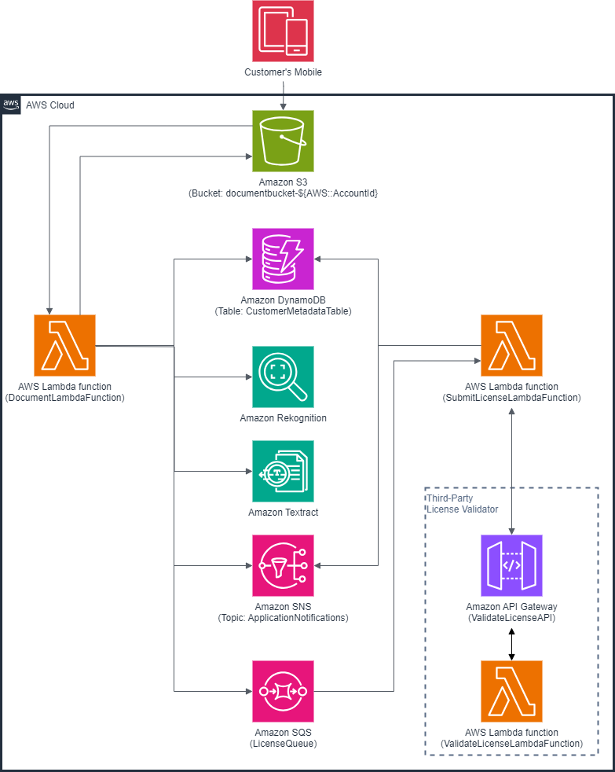
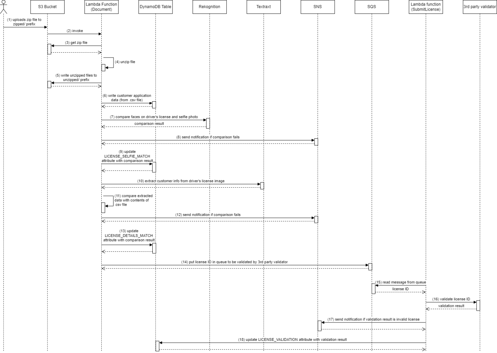
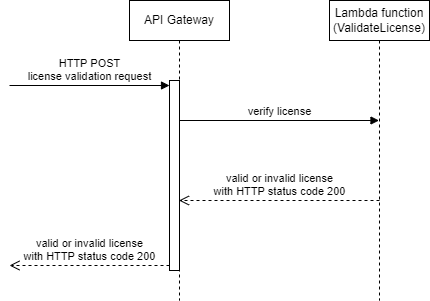

# Capstone Project: Building a Customer Onboarding Serverless Application on AWS

# Part 1: Synchronous Operations

# 

# Overview

This capstone project, part of the AWS Cloud Institute - Cloud
Application Developer Track, offers a hands-on, challenge-based lab
where I used AWS services and the Boto3 Python library to develop and
build a serverless application on AWS. The project involved utilizing
various AWS services, including S3, DynamoDB, SNS, SQS, Lambda,
Rekognition, Textract, SAM, API Gateway, Step Functions, and IAM
Permission Policies and Roles.

The purpose of this project is to build a customer onboarding serverless
application on AWS. Customer onboarding is a critical phase in a
customer's relationship with a bank. During this stage, both the bank
and the customer share essential information. This includes collecting
the necessary documentation to comply with regulatory requirements and
ensure the bank can offer relevant products and services to the
customer.

Part 1 of this project is to develop the serverless application where
all operations are executed synchronously.

Part 2 of this project modifies the serverless application in such a way
that some operations are executed asynchronously. A state machine
workflow is developed utilizing AWS Step Functions.

# Scenario

A new customer wishes to open an account with a bank. The onboarding
process starts when the customer uses the bank’s mobile app to open a
new account. The customer submits the required personal details, uploads
an image of their identification (such as a driver’s license), and then
submits a selfie or photo image. The mobile app stores the customer’s
personal details into a .csv file. The mobile app generates a unique
identification number for the customer. This unique identification
number is denoted as “**app_uuid**”. The mobile app bundles the .csv
file, the customer’s driver’s license image, and the customer’s selfie
image into a .zip file. The bank uses AWS services to validate the
customer’s personal details and selfie image by cross-checking them with
the information provided in the customer’s driver’s license.
Additionally, the bank employs a third-party license validator to
authenticate the customer’s driver’s license.

# Objective

This project builds and deploys the necessary AWS services that the bank
uses to validate and verify the customer’s personal details, selfie
image, and driver’s license. As depicted in Figure 1, the AWS services
that are utilized in this project are:
<br><br>
<figure>

<figcaption><p>&nbsp;&nbsp;&nbsp;&nbsp;&nbsp;&nbsp;&nbsp;&nbsp;
&nbsp;&nbsp;&nbsp;&nbsp;&nbsp;&nbsp;&nbsp;&nbsp;
Figure 1 Architecture of the Customer Onboarding
Serverless App using AWS services.</p></figcaption>
</figure>
<br><br>

1.  *<u>Amazon S3</u>*: This object storage service is used to store the
    customer’s .csv file, driver’s license image, selfie image, and the
    .zip file.

2.  *<u>AWS Lambda function</u>*: Named **DocumentLambdaFunction**, this
    serverless compute service is used to run the Python code of this
    project. The code interacts with other AWS services in this project
    to achieve the objective of this project.

3.  *<u>Amazon DynamoDB</u>*: This NoSQL database service is used to
    store customer’s metadata (i.e. personal details) in addition to the
    status of the verification and validation of customer’s driver’s
    license information. The DynamoDB table that is used to store such
    pieces of information is named **CustomerMetadataTable**.

4.  *<u>Amazon Rekognition</u>*: This image and video analysis service
    (powered by deep learning technology) is used in this project to
    detect photo images in the customer’s driver license. The
    **DocumentLambdaFunction** will use the outcome of this detection to
    compare it with the customer’s selfie image.

5.  *<u>Amazon Textract</u>*: This machine learning service is used in
    this project to extract text from the driver’s license image. The
    **DocumentLambdaFunction** will use the outcome of this extraction
    to compare it with the customer’s personal details.

6.  *<u>Amazon SNS</u>*: This Simple Notification Service (SNS) is used
    to send notifications (via email for example) to the customer about
    the status of their submitted application. The name of the SNS topic
    that is used for this purpose is **ApplicationNotifications**.

7.  *<u>Amazon SQS</u>*: When the **DocumentLambdaFunction** is ready to
    request from the third-party license validator to validate the
    customer's driver's license, it writes the customer's driver's
    license ID in this Amazon SQS queue. When the license ID is in the
    queue, it will invoke another Lambda function named
    **SubmitLicenseLambdaFunction**, which reads the license ID from the
    Amazon SQS queue and then submits the ID to the third-party license
    validator. The name of this queue is **LicenseQueue**.

8.  *<u>AWS Lambda function</u>*: Named **SubmitLicenseLambdaFunction**,
    this serverless compute service is used to run another Python code
    in this project. The code interacts with Amazon SQS and the
    third-party license validator to achieve the objective of this
    project. It sends an HTTP POST request to the Amazon API Gateway
    when submitting the customer’s license ID for validation.

9.  *<u>Amazon API Gateway</u>*: This RESTful API service is used in
    this project to mimic the third-party license validator. It
    represents the frontend server of the third-party license validator.
    It receives a request to validate the customer’s driver’s license ID
    from **SubmitLicenseLambdaFunction** using HTTP POST. Then it
    forwards this request to a Lambda function named
    **ValidateLicenseLambdaFunction** that will validate the
    authenticity of the customer’s driver’s license.

10. *<u>AWS Lambda function</u>*: Named
    **ValidateLicenseLambdaFunction**, this serverless compute service
    is used to mimic the third-party license validator. It represents
    the backend server of the third-party license validator. The code is
    written in Python. Its main operation is to return either a valid or
    invalid license.

# Operations

The sequence of operations is shown in Figure 2 and is described as
follows:
<br><br>
<figure>

<figcaption><p>&nbsp;&nbsp;&nbsp;&nbsp;&nbsp;&nbsp;&nbsp;&nbsp;
&nbsp;&nbsp;&nbsp;&nbsp;&nbsp;&nbsp;&nbsp;&nbsp;
Figure 2 Sequence of Operations of the Customer
Onboarding Serverless App on AWS.</p></figcaption>
</figure>
<br><br>


1)  The process starts when the bank’s mobile app uploads the .zip file
    to the bank’s Amazon S3 bucket to the **zipped/** prefix.

    - The .zip filename is: **\<app_uuid\>.zip** ; where \<app_uuid\> is the
      unique customer identification number that was assigned by the bank’s
      mobile app. For example, if the unique customer identification number
      is 98765432, then the .zip filename is: 98765432.zip

    - The bucket name is: **documentbucket-\<AccountID\>** ; where
      \<AccountID\> is the AWS Account ID of the bank. For example, if the
      AWS Account ID is 1234-5678-9012, then the bucket name is:
      documentbucket-123456789012

2)  Uploading the .zip file to the Amazon S3 bucket automatically
    triggers an event to invoke an AWS Lambda function. This function is
    denoted **DocumentLambdaFunction**.

3)  The **DocumentLambdaFunction** downloads the .zip file from the
    Amazon S3 bucket from the **zipped/** prefix.

4)  The **DocumentLambdaFunction** unzips the .zip file to the AWS
    Lambda’s internal memory **tmp/unzipped**. There are three objects
    in the .zip file:

    - The .csv file that contains the customer’s personal details. The
      filename is: **\<app_uuid\>\_details.csv**

    - The selfie image. The filename is: **\<app_uuid\>\_selfie.png**

    - The driver’s license image. The filename is:
      **\<app_uuid\>.\_license.png**

5)  The **DocumentLambdaFunction** writes the three objects to the same
    Amazon S3 bucket but to the **unzipped/** prefix.

6)  The **DocumentLambdaFunction** parses the .csv file into a
    dictionary. Then it writes this dictionary to Amazon DynamoDB table.

    - The Amazon DynamoDB table name is: **CustomerMetadataTable**

    - The partition key: HASH of **\<app_uuid\>**

    - The .csv file contains the following personal details:
```
        FIRST_NAME
        LAST_NAME
        CITY_IN_ADDRESS
        ZIP_CODE_IN_ADDRESS
        STATE_IN_ADDRESS
        DOCUMENT_NUMBER
        DATE_OF_BIRTH
        ADDRESS
```

7)  The **DocumentLambdaFunction** calls Amazon Rekognition to compare
    the selfie image in **\<app_uuid\>\_selfie.png** file with any
    detected image in the driver’s license
    **\<app_uuid\>.\_license.png** file.

8)  If the comparison fails (i.e. a match is not found), then the
    **DocumentLambdaFunction** calls Amazon SNS to publish a message
    (using an email for example) to inform the bank.

9)  The **DocumentLambdaFunction** updates the Amazon DynampDB table
    (using the partition key **\<app_uuid\>**) with the comparison
    result in the attribute LICENSE_SELFIE_MATCH.

    - LICENSE_SELFIE_MATCH is True if a match is found

    - LICENSE_SELFIE_MATCH is False if there a match is not found

10) The **DocumentLambdaFunction** calls Amazon Textract to extract
    pieces of text information from the customer’s driver’s license
    image **\<app_uuid\>.\_license.png** file.

11) The DocumentLambdaFunction compares the extracted text with the
    contents of the .csv file **\<app_uuid\>\_details.csv**.

12) If the comparison fails (i.e. the personal details that the customer
    provided do not match the details in the driver’s license), then the
    **DocumentLambdaFunction** calls Amazon SNS to publish a message
    (using an email for example) to inform the bank.

13) The **DocumentLambdaFunction** updates the Amazon DynampDB table
    (using the partition key **\<app_uuid\>**) with the comparison
    result in the attribute LICENSE_DETAILS_MATCH.

    - LICENSE_DETAILS_MATCH is True if the personal details match the
      driver’s license information.

    - LICENSE_DETAILS_MATCH is False if the personal details do not match
      the driver’s license information.

14) The **DocumentLambdaFunction** put in Amazon SQS queue the
    customer’s driver’s license ID (which is the same DOCUMENT_NUMBER in
    the .csv file **\<app_uuid\>\_details.csv**). This step is performed
    in preparation to submit the customer’s driver’s license ID to the
    third-party license validator. The message body in the SQS queue is
    in the following JSON format:

```
{
	'driver_license_id': <id>,       # where <id> is the license ID DOCUMENT_NUMBER
	'validation_override': <status>, # where <status> can be set to True (for valid ID) or False
                                         # (for invalid ID). This is used for testing purpose. It is not 
                                         # used in real-life scenario.
	'uuid': <appuuid>,               # where <appuuid> is the customer’s <app_uuid>
}
```

15) The **SubmitLicenseLambdaFunction** processes from Amazon SQS queue
    the customer’s driver’s license ID. The event that triggers this
    Lambda function is in the following JSON format:

```
record = {'body':
'{”driver_license_id”: <id>,       # where <id> is the license ID DOCUMENT_NUMBER
  ”validation_override”: <status>, # where <status> can be set to True (for valid ID)   
                                   # or False (for invalid ID). This is used for testing  
                                   # purpose. It is not used in real-life scenario.
  ”uuid”: <appuuid>}',             # where <appuuid> is the customer’s <app_uuid> 
}
```

16) The **SubmitLicenseLambdaFunction** sends an HTTP POST request to
    the third-party license validator to authenticate the customer’s
    driver’s license ID, and waits for the response. In this project,
    only the ”driver_license_id” and ”validation_override” are sent in
    the HTTP POST. The message body is in the following JSON format:

```
{
	'body':
		'{”driver_license_id”: <id>,       # where <id> is the license ID DOCUMENT_NUMBER
		”validation_override”: <status>,   # where <status> can be set to True (for valid ID)   
                                                   # or False (for invalid ID). This is used for testing  
                                                   # purpose. It is not used in real-life scenario.
                '
}
```

17) If the third-part validator responds with an invalid customer’s
    driver’s license ID, then the **SubmitLicenseLambdaFunction** calls
    Amazon SNS to publish a message (using an email for example) to
    inform the bank.

18) The **SubmitLicenseLambdaFunction** updates the Amazon DynampDB
    table (using the partition key **\<app_uuid\>**) with the comparison
    result in the attribute LICENSE_VALIDATION.

    - LICENSE_VALIDATION is True if the customer’s driver’s license ID is
      valid.

    - LICENSE_VALIDATION is False if the customer’s driver’s license ID is
      invalid.
<br><br>

# Third-Party License Validator Operations:

The sequence of operations in Figure 3 depicts the mock operations of
the third-party license validator, and is described as follows:

1)  The API Gateway receives an HTTP POST request that contains the
    ”driver_license_id” and ”validation_override”.

2)  The API Gateway forwards the request to the
    **ValidateLicenseLambdaFunction**.

3)  The **ValidateLicenseLambdaFunction** returns the value of
    ”validation_override” with the HTTP status code of 200.

4)  The API Gateway responds to the **SubmitLicenseLambdaFunction** with
    the value of ”validation_override” and the HTTP status code of 200.
<br><br>
<figure>

<figcaption><p>Figure 3 Sequence of Operations of the Third-Party
License Validator.</p></figcaption>
</figure>
<br><br>

# Instructions:

## Create Amazon SQS queues

Create two Amazon SQS queues: one queue is for the message to be
processed by the **SubmitLicenseLambdaFunction**. If the third-party
license validator does not respond within 300 seconds (5 minutes), the
message should reappear in the queue for reprocessing. The second queue
is served as a dead-letter queue. If the message fails to be processed
five times, then the message must be moved to the dead-letter queue.

Create SQS queue with the following properties:

\- Type: Standard

\- Name: LicenseDeadLetterQueue

Create SQS queue with the following properties:

\- Type: Standard

\- Name: LicenseQueue

\- Visibility timeout: 300

\- Dead-letter queue: Enabled , and choose LicenseDeadLetterQueue

\- Maximum receives: 5

## AWS Lambda Functions IAM Roles

Note: In the following policies, use your S3 Bucket name and Account ID.

1.  **DocumentLambdaFunction**: Its IAM role is named
    **DocumentLambdaRole**. It has the following Permissions Policy,
    which is named **DocumentLambdaPolicy**:

DocumentLambdaPolicy:

```json
{
    "Version": "2012-10-17",
    "Statement": [
        {
            "Action": [
                "s3:GetObject",
                "s3:PutObject",
                "s3:DeleteObject",
                "s3:HeadObject"
            ],
            "Resource": "arn:aws:s3:::documentbucket-981200967934/*",
            "Effect": "Allow"
        },
        {
            "Action": [
                "dynamodb:PutItem",
                "dynamodb:UpdateItem"
            ],
            "Resource": "arn:aws:dynamodb:us-east-1:981200967934:table/CustomerMetadataTable",
            "Effect": "Allow"
        },
        {
            "Action": "sns:Publish",
            "Resource": "arn:aws:sns:us-east-1:981200967934:ApplicationNotifications",
            "Effect": "Allow"
        },
        {
            "Action": [
                "logs:PutLogEvents",
                "logs:CreateLogGroup",
                "logs:CreateLogStream"
            ],
            "Resource": "*",
            "Effect": "Allow"
        },
        {
            "Action": "rekognition:CompareFaces",
            "Resource": "*",
            "Effect": "Allow"
        },
        {
            "Action": "textract:AnalyzeID",
            "Resource": "*",
            "Effect": "Allow"
        },
        {
            "Action": "sqs:SendMessage",
            "Resource": "arn:aws:sqs:us-east-1:981200967934:LicenseQueue",
            "Effect": "Allow"
        }
    ]
}
```

2.  **SubmitLicenseLambdaFunction**: Its IAM role is named
    **SubmitLicenseLambdaRole**. It has two Permissions Policies:
    **DynamoDBPolicy** and **AWSLambdaSQSQueueExecutionRole**. The
    **AWSLambdaSQSQueueExecutionRole** is an AWS Managed policy that is
    available for you to use and to assign to the
    **SubmitLicenseLambdaRole**.

DynamoDBPolicy:

```json
{
    "Version": "2012-10-17",
    "Statement": [
        {
            "Action": [
                "dynamodb:UpdateItem"
            ],
            "Resource": "arn:aws:dynamodb:us-east-1:981200967934:table/CustomerMetadataTable",
            "Effect": "Allow",
            "Sid": "DynamoDBUpdate"
        },
        {
            "Action": [
                "sns:Publish"
            ],
            "Resource": "arn:aws:sns:us-east-1:981200967934:ApplicationNotifications",
            "Effect": "Allow",
            "Sid": "SNSPublish"
        }
    ]
}
```

AWSLambdaSQSQueueExecutionRole:

```json
{
    "Version": "2012-10-17",
    "Statement": [
        {
            "Effect": "Allow",
            "Action": [
                "sqs:ReceiveMessage",
                "sqs:DeleteMessage",
                "sqs:GetQueueAttributes",
                "logs:CreateLogGroup",
                "logs:CreateLogStream",
                "logs:PutLogEvents"
            ],
            "Resource": "*"
        }
    ]
}
```

3.  **ValidateLicenseLambdaFunction**: Its IAM role is named
    **ValidateLicenseLambdaRole**. It has the following Permissions
    Policy, which is named **SubmitLambdaPolicy**:

SubmitLambdaPolicy:

```json
{
    "Version": "2012-10-17",
    "Statement": [
        {
            "Action": [
                "logs:PutLogEvents",
                "logs:CreateLogGroup",
                "logs:CreateLogStream"
            ],
            "Resource": "*",
            "Effect": "Allow"
        }
    ]
}
```

## Build and Deploy SAM Template

From the command line, to build the SAM template template.yaml:

*sam build*

From the command line, to deploy AWS services in template.yaml:

*sam deploy --stack-name kyc-app --guided*

(Accepts the default options when running this command)

## Subscribe to SNS Topic

Subscribe to SNS topic **ApplicationNotifications** if you want to
receive emails on the status of operations. Provide your email address
in the SNS topic. You will receive an email asking for your confirmation
on the subscription to the SNS topic.

## Sample Tests

Inside the **UnitTests** folder, there are three zip files:

8d247914.zip: The operations should succeed when uploading this sample
to S3 Bucket zipped/ folder.

7a135804.zip: This sample has a mismatch in the customer's detailed
information of the driver's license.

9c358026.zip: This sample has a mismatch in the images of the customer's
selfie and the driver's license.
